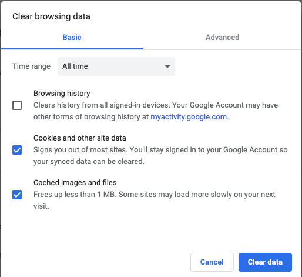
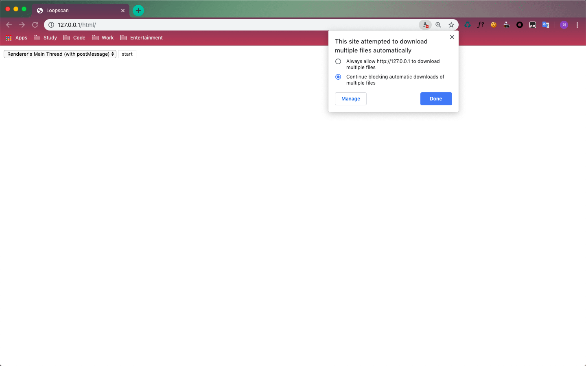

## 安装webpy

### python 3(3.7以下)

`pip install web.py==0.40-dev1`

### python 2

`pip install web.py`

## 实验流程

* 命令行到代码目录 `cd D:\code`
* 运行后台程序 `python server.py 80`
* Chrome打开 [http://127.0.0.1/static/](http://127.0.0.1/static/)

## 注意事项

* 每次代码运行前都需要清除一下缓存，网址信息保存在`js`文件中，不会随时更新，需要清除缓存手动刷新。

* 清除缓存，账号和插件信息(无痕浏览模式？)

* chrome要允许127.0.0.1弹窗权限

